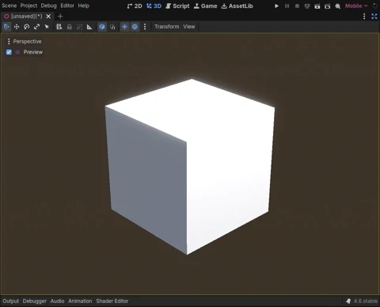

A godot plugin that implements blender's view radial menu.

Selecting the camera option will preview either the selected or the current scene's active camera. Selecting it again will return it to normal, and if you had any objects selected they will stay selected after exiting the preview cam, just like in blender.